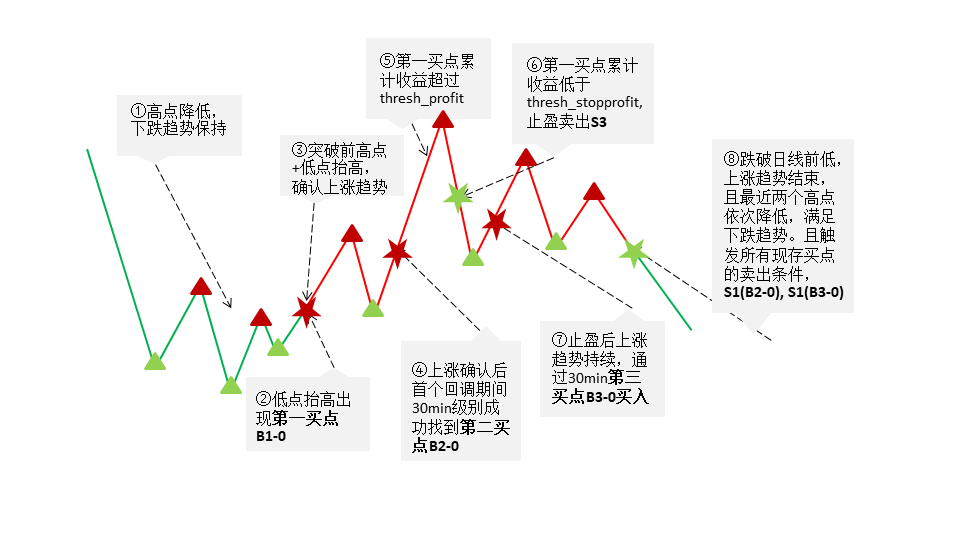
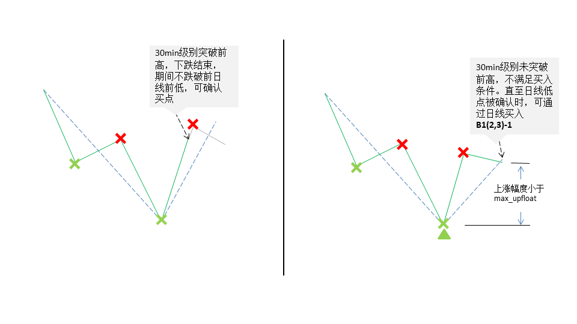
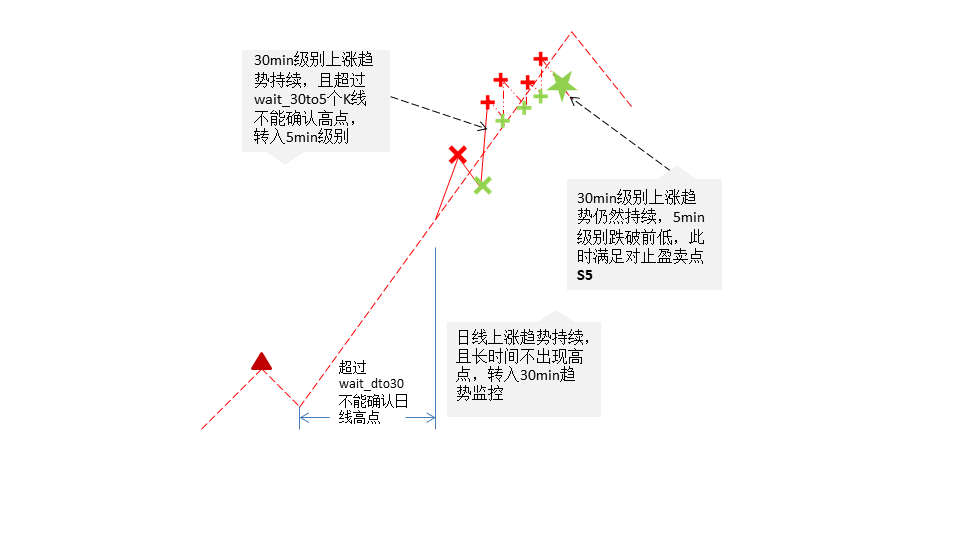
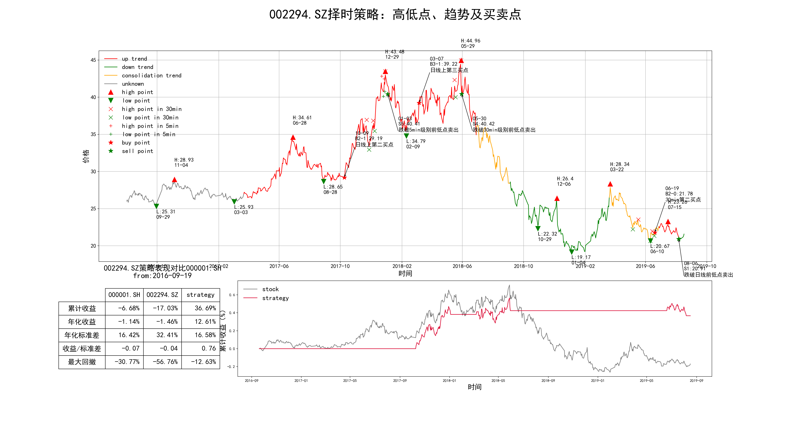

# BStrade
&emsp;&emsp;*BStrade*（Buypoint&Sellpoint trade）项目是趋势捕捉类CTA策略，向下包含[BStrend]功能，并在趋势识别功能的基础上，进一步定义买卖点信号的发出规则，实现回测区间内独立个股的交易情况和收益可视化。其核心策略部分可由依次递进的三个模块组成：
- 高低点（H or h，L or l）的定义和标定
- 依据高低点标定结果，对一段走势定义并标定趋势类型（上涨/up，盘整/consolidation or consd，下跌/down），一段较长的走势内一般包含多个趋势状态的持续和转换
- 根据一段走势内标定的趋势类型并结合期间K线的具体价格点位，在符合买点或卖点确认条件时，进行相应的买入和卖出操作
### Table of Contents/目录
<!-- TOC -->

- [Table of Contents/目录](#table-of-contents目录)
- [策略简介](#策略简介)
  - [高低点](#高低点)
  - [趋势](#趋势)
  - [高低点和趋势的初始化设定](#高低点和趋势的初始化设定)
  - [买卖点](#买卖点)
    - [买点](#买点)
    - [卖点](#卖点)
- [API文档](#api)
- [用户须知](#用户须知)
  - [1.文件及配置](#文件及配置)
  - [2.参数具体释义](#参数具体释义)
    - [backtest block](#backtest)
    - [trade block](#trade)
    - [hlp block](#hlp)
    - [trend block](#trend)
    - [bsp block](#bsp)
    - [email block](#email)
    - [dir block](#dir)
  - [3.使用接口](#使用接口)
  - [4.输出图像说明](#输出图像说明)

### 策略简介
&emsp;&emsp;与[BStrend]的设计架构相似的，[高低点](#高低点)和[趋势](#趋势)有着类似定义，本项目在其基础之上将其扩展到分钟级别数据上，并在趋势之上定义交易信号：[买卖点](#买卖点)。
#### 高低点
&emsp;&emsp;以最常用的日线级别高低点为例说明。高点和低点间隔交叉出现的。在文档及代码中，请注意以下表示高低点的用语指向同一意思表示：


|             高点             |  高点index |             低点             |  低点index |
|:----------------------------:|:----------:|:----------------------------:|:----------:|
| H,h, hpoint, Hpoint highpoint | hindex, hpi | L，l, lpoint, Lpoint lowpoint | lindex lpi |

**高点**
> i）前低点已确认的情况下，回调达到[`THRESH_D`](#thresh_d)个交易区间单位时，确认此区间的最高点为当前级别高点  
ii）前低点已确认的情况下，回调幅度超过前[`AVG_N`](#avg_n)次回调的均值（可选[`AVG_BUFFER`](#avg_buffer)），确认当前区间最高点为当前级别高点  
iii）前低点已确认的情况下，回调跌破前低点，即确认当前区间最高点为当前级别高点。  

**低点**
> i）前高点已确认的情况下，上涨达到[`THRESH_D`](#thresh_d)个交易区间单位时，确认此区间的最低点为当前级别低点  
ii）前低点已确认的情况下，上涨幅度超过前[`AVG_N`](#avg_n)次上涨的均值（可选[`AVG_BUFFER`](#avg_buffer)），确认当前区间最低点为当前级别低点  
iii）前低点已确认的情况下，上涨超过前高点，即确认当前区间最低点为当前级别低点。  

&emsp;&emsp;分钟级别高低点在定义上是类似的，但是其各自拥有该级别的参数30min级别高低点用[`thresh_30、THRESH_30`](#thresh_30)替代[`thresh_d、THRESH_D`](#thresh_d)，5min级别高低点用[`thresh_5、THRESH_5`](#thresh_5)替代[`thresh_d、THRESH_D`](#thresh_d)。以及分钟级别高低点的使用作为买卖点信号的辅助，其高低点标定标准仅适用i)时间原则。

#### 趋势
&emsp;&emsp;本项目中定义三种趋势类型：
* `up`上升趋势
* `down`下跌趋势
* `consd`盘整趋势

**上涨**
> *上涨趋势的确认*：
i）出现连续两个低点抬高和高点抬高  
 $h_i,l_i,h_{i+1},l_{i+1};h_{i+1}>h_{i}, l_{i+1}>l_{i} $  
 $l_i,h_i,l_{i+1},h_{i+1};l_{i+1}>l_{i},;h_{i+1}>h_{i}$  
 ii）当最高点距离前日线低点[`TREND_REV`](#trend_rev)个交易日时，则确认为日线上涨趋势  
*上涨趋势的延续*：低点依次抬高  
*上涨趋势结束*：  
i）转入盘整趋势  
 $h_i,l_i,h_{i+1},l_{i+1};h_{i+1}>h_{i} \ and \ l_{i+1}<l_i$  
 ii）转入下跌趋势  
 $h_i,l_i,h_{i+1},l_{i+1};h_{i+1}<h_i \ and \ l_{i+1}<l_i$  

 **下跌**
 > *下跌趋势的确认*：  
 i）出现连续两个低点降低和高点降低  
  $h_i,l_i,h_{i+1},l_{i+1};h_{i+1}<h_{i} \ and\ l_{i+1}<l_{i} $  
  $l_i,h_i,l_{i+1},h_{i+1};l_{i+1}<l_{i}\ and\ h_{i+1}<h_{i}$  
  ii）当最低点距离前日线低点[`TREND_REV`](#trend_rev)个交易日时，则确认为日线下跌趋势  
 *下跌趋势的延续*：高点依次降低  
 *下跌趋势结束*：  
 i）转入盘整趋势  
  $h_i,l_i,h_{i+1},l_{i+1};h_{i+1}<l_{i},l_{i+1}>l_i$  
  ii）转入上涨趋势  
  $h_i,l_i,h_{i+1},l_{i+1};h_{i+1}>h_i,l_{i+1}>l_i$  

  **盘整**
  > *盘整趋势的确认*：  
  > 由以上上涨趋势和下跌趋势确认转入盘整趋势的  
  在序列最初高低点较少时，无法被归类于上涨或下跌趋势的，暂时归类为盘整趋势  
  *盘整趋势的结束*：满足上涨或下跌趋势的确认定义，结束盘整趋势而转入上涨或下跌趋势。  

#### 高低点和趋势的初始化设定
&emsp;&emsp;在回测时，需要解决在遍历数据列表之前对于高低点和趋势的初始化问题。由于策略算法基于迭代规则，因此初值是必要的。初始化的原则是尽可能耗费较少的数据选择出合适的初值。幸运的是，当回测时期较长的时候，初值对于之后策略表现（主要是判断准确度）的影响会渐渐衰减。  
<b>*高低点的初始化设定*</b>
&emsp;&emsp;从序列首开始遍历日线数据，如果找到第一个分型类型是底分型，那么设该底K线为待判定低点，转而进入低点判定分支；如果第一个分型是顶分型，那么设定该顶K线为待判定高点，转而进入高点判定分支。关于分型的具体定义如下：
> *顶分型*：  
$K_{i-1}.h\le K_i.h\ and\ K_i.h\ge K_{i+1}.h \ and \ not \ K_{i-1}.h=K_i.h=K_{i+1}.h:称K_i$为该顶分型的顶
*底分型*：  
$K_{i-1}.l\ge K_i.l\ and\ K_i.l\le K_{i+1}.l\ and \ not \ K_{i-1}.l=K_i.l=K_{i+1}.l:称K_i$为该底分型的底

<b>*趋势的初始化设定*</b>  
&emsp;&emsp;趋势判别在回测算法中需要在遍历数据列表判定完回测区间内所有高低点后进行。趋势初始化需要至少确认3个高点或低点（<font color="red">NOTE：此处定义较[BStrend]有差别</font>），枚举所有组合可能：
- $l_0, h_0, l_1; l_1>l_0\Rightarrow$`up`
- $l_0, h_0, l_1; l_1<l_0\Rightarrow$`consd`
- $h_0, l_0, h_1; h_0<h_1\Rightarrow$`down`
- $h_0, l_0, h_1; h_0>h_1\Rightarrow$`consd`
此外在第3个高点或者低点被确认之前的K线趋势都设置为缺失类`None`。

#### 买卖点
&emsp;&emsp;买卖点即买卖信号，一个完整的买点或卖点概念，包含{名称，符号，类型，类型代码，具体买入价格，买入时的走势形态，后续可能卖出或买入机会}。本项目定义的类型及简要说明如下。
```python
# K线级别
K_LEV_DICT = {1: "daily", 2: "30min", 3: "5min"}
# 交易类型
BUYSELL_TYPE = {"B1-0": ("B", 1, 0, "30min第一买点"),
              "B1-1": ("B", 1, 1, "日线上第一买点"),
              "B2-0": ("B", 2, 0, "30min第二买点"),
              "B2-1": ("B", 2, 1, "日线上第二买点"),
              "B3-0": ("B", 3, 0, "30min第三买点"),
              "B3-1": ("B", 3, 1, "日线上第三买点"),
              "S1": ("S", 1, "跌破日线前低点卖出"),
              "S2": ("S", 2, "按照买点的止损点卖出"),
              "S3": ("S", 3, "浮盈止盈点卖出"),
              "S4": ("S", 4, "跌破30min级别前低点卖出"),
              "S5": ("S", 5, "跌破5min级别前低点卖出")}
```
&emsp;&emsp;以下图示说明一个波段内买卖点发生的机制。

##### 买点
&emsp;&emsp;对于每个可能的买点，都有两次买点寻找的机会。在确认高点的同时，可以开始买点的寻找，首先进入30min的高点判定。如下图：

&emsp;&emsp;如左图，从确认日线高点开始进入30min高低点标定，默认是下跌趋势，发现30min K线突破前30min高点，在30min级别上结束了下跌趋势，因此构成30min的买点。
- 如果此时日线上最近两个高点依次降低，则该买点为第一类买点，记号为**B1-1**。
- 如果此时已经处于上涨阶段，且是在上涨阶段内未出现过买点，则此时为第二买点**B2-1**
- 如果此时仍处于上涨阶段，且此时此前的买点通过止盈方式卖出，则可在确认最近日线高点的同时通过进入30min买点寻找第三类买点**B3-1**

&emsp;&emsp;如右图，若在当前日线低点确认前还没有通过30min找到买点，且当前日线低点没有跌破前日线低点，可在确认日线低点的同时考虑以当前日线价格买入。[`max_upfloat`](#max_upfloat)参数限制当前价格自日线低点价格的上涨幅度，如果超过该涨幅则放弃该买点。

##### 卖点
&emsp;&emsp;卖点与买点是相对的概念，且一个卖点只能为一个买点出场。若一个买点在存续期间内有多个可参考卖出点位，则其最高的卖出点位为有效卖点目标价格（**卖点孰高原则**）。买点只要在价格跌破任一卖点目标价格时就可执行卖出交易。
- 第一类卖点**S1**，适用于所有类型的买点，其参考价格为前日线低点价格，一旦价格跌破前日线低点价格，趋势不可能处于上涨当中，所有存续买点应该出场
- 第二类卖点**S2**，也适用于所有买点，但其定义为所有买点在买入时即可确定的目标价格。对于日线级别买入的买点，一般是买入时的日线低点。对于30min买入的买点，可以通过[`stop_p_buffer_30`](#stop_p_buffer_30)参数调节其卖点价格，其埋点价格计算为$(1+stop \, p \, buffer \, 30)low \, 30$即最近30min低点价格上下浮动一个buffer。前两类卖点都属于止损卖点
- 第三类卖点**S3**，触发条件为该买点累计收益曾经达到[`thresh_profit`](#thresh_profit)，此后如果累计收益下降到[`thresh_stopprofit`](#thresh_stopprofit)时卖出。第三类卖点在意义上是止盈卖点，但在具体情况中不严格保证高于前两类买点。
- 第四类卖点**S4**，触发条件为上涨过程中，在30min级别上结束上涨趋势时卖出。属于止盈卖点。
- 第四类卖点**S5**，触发条件为上涨过程中，在5min级别上结束上涨趋势时卖出。属于止盈卖点。

&emsp;&emsp;S4和S5两类卖点涉及到交易级别的转换，以下图示例。


### <span id="api">API文档</span>
&emsp;&emsp;`python-sphinx`被用于自动生成代码文档。可下载[build](build)文档浏览。
### 用户须知
#### 文件及配置
&emsp;&emsp;本策略运行依赖与多个超参数设置，参数设置的具体数值对策略表现有显著影响。用户通过配置文件`config.conf`进行参数调试。  
&emsp;&emsp;下面给出一个标准的`config.conf`文件模板:
```
# 参数配置文件，以下参数可以直接修改，但需要遵照默认格式
# 字符串请使用单引号

# 回测基本参数
[backtest]
# 回测类型：
# mode=0 只看回测，结束时间可以非当天，不会继续监控盘中
# mode=1 为了之后盘中交易而回测，结束时间需为当天，或者当前最后一个交易日的日期
mode = 1
# 回测开始时间，最好距当今时间37个月之内
begin_date = '2015-09-30'
# 回测结果评估开始时间，不应当早于回测开始时间
performance_begin_date = '2015-10-31'
# 回测结束时间
end_date = '2018-10-31'
# 一天内30min K线个数
n_30 = 8
# 回测图像
  # ''表示不画图
  # 'n'表示画出前n只股票的回测图像
  # 'm:n'表示画出第m到第n只股票的图像
  # 'xxxxxx.SH;yyyyyy.SZ;zzzzzz.SH'表示画出特定股票的图像
paint = '0'
# benchmark市场指数
benchmark = '000001.SH'
# 一年内交易日天数
n_trade = 255

# 交易基本参数
[trade]
# 初始资金，单位（百元）
init_fund = 1000
# 第一买点买入比例
buy1_pct = 0.4
# 第二买点买入比例
buy2_pct = 0.6

# 高低点参数
[hlp]
# 日线结构高低点间隔
thresh_d = 13
# 30min结构高低点间隔
thresh_30 = 16
# 5min结构高低点间隔
thresh_5 = 20
# 超过前n次平均反弹幅度均值判定低点
avg_n = 3
# 前n次反弹均值反弹幅度调和参数，幅度均值*avg_buffer
avg_buffer = 1

# 趋势参数
[trend]
# 空间趋势转换最小间隔
trend_rev = 65

# 买卖点参数
[bsp]
# 日线上买入的买点距离低点最高涨幅
max_upfloat = 0.16
# 日线级别转换为30min级别距离前低点不确认高点天数
wait_dto30 = 55
# 30min级别转换为5min级别距离前低点不确认高点30minK线数
wait_30to5 = 75
# 最低浮盈限制以适用浮盈止损规则
thresh_profit = 0.21
# 适用浮盈规则的止损时最低盈利
thresh_stopprofit = 0.08
# 通过30min买入的买点，止损点定为买点最近一个30min低点，在此基础上加一个宽容度，止损点定为low*(1+STOP_P_BUFFER_30)
stop_p_buffer_30 = -0.05

# 发信设置
[email]
# 发信邮箱
sender = '#####@#########.com'
# 发信邮箱密码
sender_key = '#########'
#收信邮箱地址
receiver = '#########@####.com'
# 发信频率, 1为变动时发信， 0为每日发信
freq = 1
# 定时任务1设定时间
job1_time = '15:50'
# 定时任务2设定时间
job2_time = '07:00'

# 文件地址设置
[dir]
# 回测股票代码地址，.txt文件，最好使用/而不是\号
code_file = 'C:/Users/zhangchangsheng/Desktop/Strategy_s/code1.txt'
# 工作文件夹地址
work = 'C:/Users/zhangchangsheng/Desktop/Strategy'
# 图像存放位置
graph = 'C:/Users/zhangchangsheng/Desktop/Strategy/graph_trend'
```

#### 参数具体释义
<span id="backtest"><u>**[backtest]**</u></span>
**mode**
> `int`, 0或者1，控制程序的运行模式；由于目前版本只实现了回测功能。因此两种模式之间无大差别。注意，`mode=1`表示从回测开始时间回测到当前最近一个交易日；`mode=0`表示从回测开始时间回测到设定的回测结束时间。`mode=1`相当于缺省回测结束时间`end_date`参数为当前日期。

**begin_date**
> `str`，形式为`%Y-%m-%d`或表示为`yyyy-mm-dd`。注意回测开始时间为数据最早提取时间，不代表最早可能发生交易信号的时间（交易信号的发出需要burn in一段数据）。此外由于程序数据来源为WindPy的量化接口，并需要提取分钟级别的数据，而WindPy只支持近3年（从运行程序当天日期严格前推3年），因此回测开始日期的设置不应距今超过37个月。

**performance_begin_date**
> `str`，形式为`%Y-%m-%d`或表示为`yyyy-mm-dd`。为统计策略回测区间收益时的开始日期，应当不早于策略回测发生日期。设置这一参数是用于与基准指数（或该股票自身）在统计区间表现时，尽量贴近策略第一笔交易发生的日期，从而过滤掉股票或市场在`begin_date`和`performance_begin_date`时间段内可能发生的较大波动（因此区间段内，无论股票自身或市场走势表现如何，都是不会产生信号的，因此此段时间内的策略波动为0）对结果产生的影响，尤其是回测时长受限为3年的情况下。

**end_date**
> `str`，形式为`%Y-%m-%d`或表示为`yyyy-mm-dd`。设定的回测结束日期，注意如果设置`mode=1`，该参数将被忽略

**n_30**
> `int`，一个交易日内30min K线的个数。与每个市场的交易时长有关。但目前WindPy仅支持A股上市股票的分钟数据，<font color="red">因此该参数固定设置为8</font>.

**paint**
> `str`，设置在连续回测多个股票时，画出回测图像指定序号的方式。<font color="red">Warning：该参数为保留*BStrend*相关功能。目前尚未在本项目中实现相关功能</font>。<font color="skyblue">TODO：在多股票连续回测时增添该参数控制功能</font>。`paint`字符串应当符合以下4种形式之一：  
a. `""`空字符串表示步不画出任何股票的图像  
b. `n`，表示画出前$n$股票的图像  
c. `m:n`，表示画出序号从第m到第n只股票的图像  
d. `XXXXXX.SH;XXXXXX.SH;XXXXXX.SZ`, 用$;$分隔开具体的股票代码，画出该序列中股票的图像

**benchmark**
> `str`，指定作为基准的市场指数，将出现在回测表现统计中。展示其与策略的区间收益、年化收益、年化波动率、收益波动比、最大回撤。

**n_trade**
> `int`，一年当中交易日的天数，用于计算年化收益和年化波动率。

<span id="trade"><u>**[trade]**</u></span>
**init_fund**
> `int, float`分配各每只股票的初始资金，单位（百元）

**buy1_pct**
> `float`，0~1，第一通过第一买点买入股票，仓位占当前账户现金的比重。由于第一买点买入股票时，股票必然不存在多头仓位（已有仓位都已经清仓），即用$buy1 \, pct*cash$得到买入的资金量

**buy2_pct**
> `float`，0~1，在已有第一买点的情况下，在第二买点买入股票所占资金比例。一般设置为$1-buy1 \, pct$，含义为用`buy1_pct`比例资金在第一买点买入，剩余所有资金在第二买点买入。**注意**，如果在第二买点出现前没有出现第一买点，则在$buy1 \, pct+buy2 \, pct=1$的条件下，全部资金都用于第二买点的买入。更一般的，对于$buy1 \, pct+buy2 \, pct<1$，第二买点先于第一买点出现时，第二买点买入资金量计算为$\frac{buy2 \, pct}{1-buy1 \, pct}$

<span id="hlp"><u>**[hlp]**</u></span>
<span id="thresh_d">**thresh_d**</span>
> `int`，日线结构[高低点](#高低点)的间隔，默认值为13

<span id="thresh_30">**thresh_30**</span>
> `int`，30min结构[高低点](#高低点)的间隔

<span id="thresh_5">**thresh_5**</span>
> `int`，5min结构[高低点](#高低点)间隔

<span id="avg_n">**avg_n**</span>
> `int`，在[高低点](#高低点)确认的第ii)条判定条件中，取前`avg_n`次上涨或回撤的幅度做参考。如果当前尚未出现`avg_n`次上涨或回撤，那么这个判定条件不起作用。默认值取3。

<span id="avg_buffer">**avg_buffer**</span>
> `int，float`，在`avg_n`次上涨或回调的均值基础上做一定的调整，以此结果作为当前[高点或低点](#高低点)判定的参考。例如，当前待判定低点，待判定低点的价位为$l_0$，从待判定低点到当前区间内的最高价为$h$，设定`avg_n`=3，前3次上涨的幅度（指从低点到紧接着的高点的涨幅大小）分别为$u_1,u_2,u_3$，那么如果$\frac{h-l_0}{l_0}>\frac{u_1+u_2+u_3}{3}*$`avg_buffer`，即可确认当前待判定低点为低点。默认`avg_buffer`为1，即不对均值做调整。

<span id="trend"><u>**[trend]**</u></span>
<span id="trend_rev">**trend_rev**</span>
> `int`，适用上涨/下跌趋势的确认第ii)条准则。例如，当前处于下跌或盘整趋势，并且最近一个确认的高低点类型为低点，那么在被确认的低点当天至当前的区间内最高点的时间超过`trend_rev`个交易日，即可判定上涨趋势成立。反之，如果当前处于上涨或盘整阶段，并且最近一个确认的高低点类型为高点，那么在被确认高点当天至当前的区间内最低点当天的时间间隔超过`trend_rev`个交易日，即可判定下跌趋势成立。

<span id="bsp"><u>**[bsp]**</u></span>
<span id="max_upfloat">**max_upfloat**</span>
> `float`，30min买点寻找失败后，在随后确认日线低点时若不跌破前低，则满足日线买点部分条件，随后通过`max_uploat`决定是否通过在日线买入的限制。eg,确认低点价格为$Low$，确认低点当天收盘价$close$，如果$\frac{close}{Low}>1+$`max_upfloat`，则由于上涨果断放弃该买点买入机会，否则可以买入该买点。该参数取越大值则买入态度更激进，该值较小时交易态度趋于保守。

<span id="wait_dto30">**wait_dto30**</span>
> `int`，在上涨趋势中，当上涨趋势持续时间较长时，日线级别高点可能较长时间不出现，此时可转入30min级别操作。`wait_dto30`设定日线级别转换为30min级别距离前低点不确认高点天数。

<span id="wait_30to5">**wait_30to5**</span>
> `int`，在上涨趋势中，当上涨趋势持续时间较长时，且已经由日线级别转入30min级别，如果30min级别上涨趋势仍然持续，且最近低点至今超过`wait_30to5`个30minK线不出现30min高点或日线高点，则转入5min级别。

<span id="thresh_profit">**thresh_profit**</span>
> `float`，浮盈止损限制。如果通过该买点买入的股票累计收益率曾经达到过`thresh_profit`，则可适用止盈规则，在收益率低于`thresh_stopprofit`时卖出。

<span id="thresh_stopprofit">**thresh_stopprofit**</span>
> `float`，与`thresh_profit`一起使用，对于一个买点，其买入资产价格为$p$，当价格突破$p(1+thresh \, profit)$后，需要在价格低于$p(1+thresh \, stopprofit))$时卖出。

<span id="stop_p_buffer_30">**stop_p_buffer_30**</span>
> `float`，正负不限。通过30min买入的买点，止损点定为买点最近一个30min低点$low$，在此基础上加一个宽容度，止损点定为$low(1+stop \, p \, buffer \, 30)$

<span id="email"><u>**[email]**</u></span>：<font color="red">Warning:该模块功能在本版中未启用，为兼容[BStrend]保留</font>
**sender**
> `str`，完整邮箱地址字符串，注意发信邮箱当前支持的邮箱地址后缀包括 163.com | winforcap.com | nedugroup.com | sina.com | sohu.com | 126.com | qq.com | hotmail.com | gmail.com | foxmail.com。

**sender_key**
> `str`,发信邮箱密码。

**receiver**
> `str`,收信人邮箱，如果有多个收信人，用;分隔

**freq**
> `int`，发送邮件的频率设定。设定为1则仅在运行当天出现至少一只股票趋势变化时发送邮件，否则不发送邮件；设定为0则在运行当天不管是否出现趋势变化都会发送邮件。

**job1_time**
> `str`，格式为`mm:ss`，模拟交易中每日收盘行情更新时间。不应该早于15:00,。考虑WindPy数据更新时间，建议设置为16:00或以后。

**job2_time**
> `str`，格式为`mm:ss`，模拟交易中美股每日收盘行情更新时间，由于时差，建议设置为“07:00”。<font color="red">Warning:使用分钟数据的情况下，不支持美股，该参数可忽略。</font>

<span id="dir"><u>**[dir]**</u></span>
<span id="code_file">**code_file**</span>
> `str`，文件地址字符串（绝对路径），指定待回测股票文件的绝对路径。

**work**
> `str`，文件夹地址字符串，即管理该项目工作内容的文件夹地址，建议将输入文件、输出图像文件和数据库文件都设为该文件夹下的子文件（夹）。

<span id="graph">**graph**</span>
> `str`，文件夹地址字符串（绝对路径），回测图像，及运行中产生的趋势变化后所重绘的更新图像文件存放文件夹地址。

#### 使用接口
&emsp;&emsp;`graph.py`文件为main函数入口，在`config.conf`[文件设置](#文件及配置)完成后，运行`graph.py`,程序读取[`code_file`](#code_file)中的股票代码，并进行回测，输出其图像至[`graph`](#graph)文件夹。

#### 输出图像说明
&emsp;&emsp;回测输出图像包含回测期间发生的高低点、趋势和交易信息，以及策略交易产生的收益变动情况。以002294SZ（信立泰）在201608~201908区间内的回测表现为例。


&emsp;&emsp;如左上角图例所所示：
- 主图信息
  - `高低点`：
    - 红△（日线高点）
    - 绿△（日线低点）
    - 红×（30min高点）
    - 绿×（30min低点）
    - 红+（5min高点）
    - 绿+（5min低点）
  - `趋势`：
    - 灰色段（不确定,burn_in阶段）
    - 红色段（上涨阶段）
    - 黄色段（盘整阶段）
    - 绿色段（下跌阶段）
  - `买卖点`
    - 红☆（买点），买点具体类型、时间和买入价格通过箭头→指示信息说明
    - 绿☆（卖点），卖点具体类型、时间和买入价格通过箭头→指示信息说明
- 第二附图
  - 策略累计收益曲线（红色段）
  - 股票累计收益曲线（灰色段）
- 表现统计
  - 区间累计收益、年化收益、年化标准差、收益/标准差，最大回撤

[BStrend]: https://github.com/MaggieHu77/Winfor-BStrend
